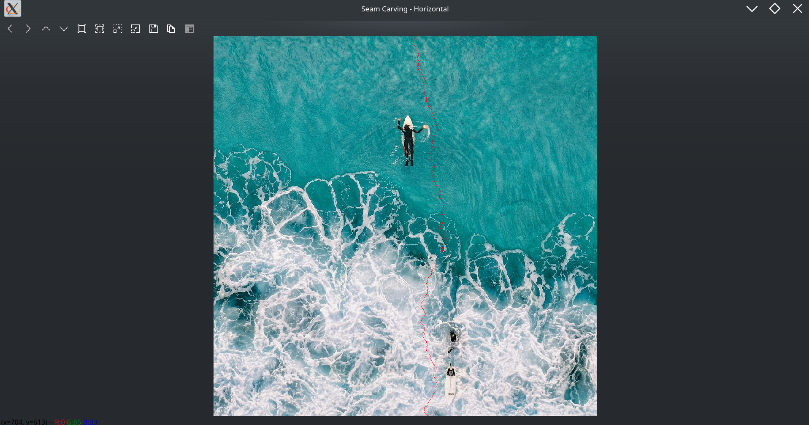
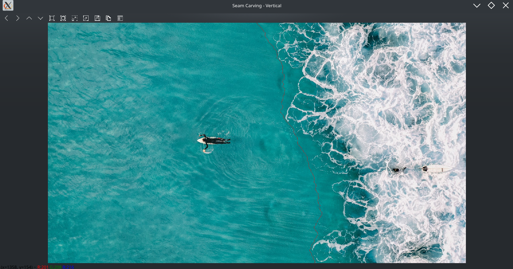
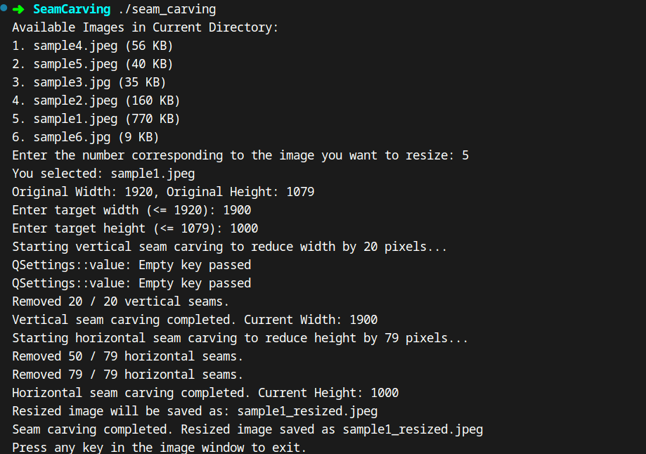

# Seam Carving Algorithm

Seam Carving is a content-aware image resizing technique that resizes images by removing or adding "seams"—paths of pixels with the least importance. This approach allows you to change the aspect ratio or size of an image while preserving important visual features, unlike traditional scaling methods that can cause distortion.

## Table of Contents

1. [Introduction](#introduction)
2. [Features](#features)
3. [How It Works](#how-it-works)
4. [Demo](#demo)
5. [Installation & Compilation](#installation--compilation)
6. [Usage](#usage)
7. [Examples](#examples)
8. [File Structure](#file-structure)
9. [Contributing](#contributing)
10. [License](#license)

## Introduction

Seam Carving removes "seams" (vertical or horizontal paths of pixels) that have the lowest energy, effectively preserving important parts of the image while discarding less important areas. This makes it possible to reduce width or height without simply scaling, thereby maintaining the image’s content and structure more naturally.

## Features

- **Content-Aware Resizing:** Adjust image dimensions while preserving important content.
- **Vertical and Horizontal Seam Removal:** Remove seams from either the width or height dimension.
- **Real-Time Visualization:** Displays seams being removed step-by-step.
- **Automated Output Naming:** The resized image is saved with `_resized` appended to the original filename.

## How It Works

1. **Energy Calculation:** Each pixel’s energy is computed using a dual-gradient energy function. Higher energy indicates a more important pixel.
2. **Cost Matrix Computation:** A cost matrix is built to find the least-energy seam from top to bottom (vertical) or left to right (horizontal).
3. **Seam Identification:** The minimal-energy seam is found by tracing back from the minimum energy found in the last row or column of the cost matrix.
4. **Seam Removal:** The identified seam is removed, effectively resizing the image by one pixel.
5. **Iteration:** This process repeats until the desired target dimensions are reached.

## Demo

### Original vs. Resized Image

- **Original Image (sample1.jpeg):**
  
  

- **Resized Image (sample1_resized.jpeg):**

  After removing seams, the resulting image is:
  
  

### Seam Removal Visualization

- **Horizontal Seam Removal Process:**
  
  Horizontal seams are highlighted in red during removal:
  
  

- **Vertical Seam Removal Process:**

  Vertical seams are highlighted as well, showing the path of least important pixels:
  
  

### Sample Output

An example of a final output after performing seam carving:
  


## Installation & Compilation

### Prerequisites

- C++ compiler supporting C++17 or later (e.g., `g++`).
- OpenCV 4.x installed.
- `pkg-config` for including OpenCV flags.

#### Installing OpenCV (Ubuntu/Linux)
```bash
sudo apt update
sudo apt install libopencv-dev
```

#### Installing OpenCV (macOS via Homebrew)
```bash
brew update
brew install opencv
```

#### Installing OpenCV (Windows)
- Download pre-built OpenCV binaries from the [OpenCV Releases](https://opencv.org/releases/).
- Follow the [OpenCV Installation Guide](https://docs.opencv.org/master/df/d65/tutorial_table_of_content_introduction.html) for detailed Windows setup instructions.

### Compilation

In the project directory:
```bash
g++ -o seam_carving Seam_Carving.cpp `pkg-config --cflags --libs opencv4` -std=c++17
```

This produces an executable named `seam_carving`.

## Usage

1. **Run the Executable:**
   ```bash
   ./seam_carving
   ```

2. **Select an Image:**
   The program lists all images in the current directory. Enter the number corresponding to the image you want to resize.

3. **Enter Target Dimensions:**
   Provide the target width and height, which must be less than or equal to the original dimensions.

4. **Seam Removal Process:**
   Watch seams being removed in real-time. Press `Esc` to interrupt if needed.

5. **Result:**
   The resized image is saved as `<original_name>_resized<extension>`.

## Examples

- **Reducing Width Only:**  
  Set `targetWidth` smaller than the original width and keep `targetHeight` the same.  
- **Reducing Height Only:**  
  Set `targetHeight` smaller than the original height and keep `targetWidth` the same.  
- **Reducing Both Dimensions:**  
  If both width and height need to be smaller, the algorithm first removes vertical seams, then horizontal seams (or vice versa by internally transposing the image).

## File Structure
```plaintext
Seam-Carving-Algorithm/
├── assets/
│   ├── Horizontal_seam_removal.png
│   ├── sample_output.png
│   └── vertical_seam_removal.png
├── sample1.jpeg
├── sample1_resized.jpeg
├── sample2.jpeg
├── sample3.jpg
├── sample4.jpeg
├── sample5.jpeg
├── sample6.jpg
├── Seam_Carving.cpp
└── README.md
```

- **Seam_Carving.cpp:** Main C++ source implementing the seam carving algorithm.
- **assets/**:
  - **Horizontal_seam_removal.png:** Visualization of horizontal seam removal.
  - **sample_output.png:** Additional sample output image.
  - **vertical_seam_removal.png:** Visualization of vertical seam removal.

## Contributing

1. Fork the repository.
2. Create a new branch (`git checkout -b feature/YourFeature`).
3. Commit your changes (`git commit -am 'Add new feature'`).
4. Push to the branch (`git push origin feature/YourFeature`).
5. Open a pull request.

## References

- **Seam Carving Algorithm**: The algorithm and its implementation are inspired by the concepts discussed in the [Princeton University COS 226 course](https://www.cs.princeton.edu/courses/archive/fall17/cos226/assignments/seam/index.html).


```
